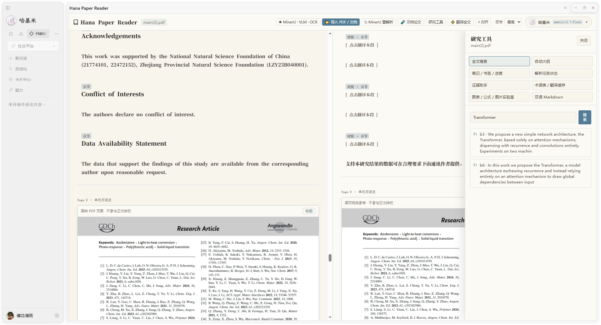

# Hana Paper Reader

面向 **HanaAgent** 的可引用双语论文精读工作台。

它不只是把 PDF 翻译成中文，而是把论文转换为一个可以搜索、定位、引用、提问、批注和导出的研究工作区：**MinerU 提取语义结构，PDF.js 保留原始页面证据，Hana 助手负责翻译与解释，稳定的 `Page X / block Y` 锚点把每个结论带回原文。**

- 当前版本：`0.5.0`
- 插件 ID：`hana-paper-reader`
- 最低 Hana 版本：`0.358.0`
- 许可证：MIT
- 运行方式：无构建步骤、无 npm 依赖的 direct WebView 插件



## 为什么是 Paper Reader

普通 PDF 阅读器解决“把页面显示出来”，Hana Paper Reader 解决的是另一组问题：

- 这段译文对应原文哪一页、哪一个结构块？
- 助手给出的结论能不能回到论文证据？
- 图、表、公式和正文能否在双语阅读中保持一致？
- 笔记、术语、书签和阅读进度能否在下次打开时继续使用？
- 同一份 PDF 能否避免重复上传和重复解析？
- 阅读结果能否离开插件，沉淀为带证据锚点的 Markdown？

0.5.0 围绕这些问题建立了一套本地优先、证据优先的研究工作流。

## 核心能力

### 连续双语精读

- 支持 PDF、TXT 和 Markdown。
- PDF 由 MinerU 提取标题、段落、图片、图表、表格和公式结构。
- 正文统一重排为连续单栏，不把原 PDF 的多栏版面硬塞进阅读流。
- 英文原文与中文译文分栏呈现；窄窗口自动切换为上下布局。
- 支持单段翻译、全文批量翻译和按结构块对齐。
- 纯图片、空视觉块和无说明公式不会被无意义地送入翻译模型。

### 可核验的引用锚点

每个论文结构块都维护稳定的来源信息：

```text
paperHash
blockId
page
bbox
blockType
```

正文可直接复制带来源引用，例如：

```text
【论文引用】
论文：Attention Is All You Need
来源：Page 5 / block mineru_p5_b12
锚点：#paper-p5-b-mineru_p5_b12
原文：...
```

证据助手只能引用当前工作区中真实存在的 `Page X / block Y`，客户端提供的页码和 block 只作为线索，最终由插件后端重新核验。

### 研究工作区

点击顶部 **研究工具** 可以使用：

| 工具 | 能力 |
|---|---|
| 全文搜索 | 搜索原文与译文，按页码和结构块定位 |
| 自动大纲 | 根据标题块生成论文目录并跳转正文 |
| 笔记 / 书签 / 进度 | 将研究标记绑定到真实论文块，支持单条删除 |
| 解析任务状态 | 查看解析阶段、进度、失败原因并取消运行中任务 |
| 证据助手 | 使用当前论文上下文提问，返回可定位的真实证据 |
| 术语表 / 翻译缓存 | 固定专业译法，并按术语版本隔离旧译文 |
| 图表 / 公式 / 图片实验室 | 按视觉结构类型筛选并跳回正文位置 |
| 双语 Markdown | 导出原文、译文、引用、笔记、书签、进度和术语 |

### 工作区自动恢复

重新打开插件时，会恢复最近论文的：

- 结构块和大纲；
- 已生成译文；
- 笔记与书签；
- 阅读进度；
- 术语版本和有效翻译缓存。

浏览器不会永久保留本地 PDF 文件句柄，因此结构内容可以自动恢复，但 PDF.js 原页预览需要用户重新选择同一 PDF。重新选择后会通过 SHA-256 命中解析缓存，不必再次完整上传解析。

### 标准 SHA-256 解析缓存

- 浏览器对 PDF 计算标准 SHA-256 文件指纹。
- 插件后端按文件指纹复用 MinerU 解析结果。
- 再次选择完全相同的 PDF 时，可直接恢复结构块和资源。
- 浏览器原生 Web Crypto 与内置 fallback 使用同一组标准测试向量验证。

### 术语版本化翻译

术语表不是只在界面上展示，它会参与翻译请求和缓存键：

```text
paperHash + blockId + glossaryVersion
```

新增、修改或删除术语后，术语版本增加，旧版本译文立即失效，避免旧译法从缓存重新出现。

### 图、表、公式与原页证据

- 优先展示 MinerU 结果 ZIP 中被正文实际引用的图片资源。
- 只有坐标而没有独立资源时，可从当前本地 PDF 原页生成视觉裁剪。
- 表格 HTML 经过标签、属性、节点数量和体积限制后再渲染。
- 公式保留 LaTeX、公式文本和可用的原页定位。
- 两侧阅读区复用同一视觉资源，翻译只改变说明文本。
- PDF.js 仅负责本地原页预览和定位，不参与正文结构解析。

## 工作原理

```text
本地 PDF
  ├─ 浏览器计算 SHA-256 ──> 查询插件私有解析缓存
  ├─ 原始 application/pdf ─> 插件后端 ─> MinerU 官方 API
  └─ 本地文件字节 ─────────> PDF.js 原页视觉预览

MinerU 结果 ZIP
  └─ 结构 JSON + 受支持图片
       └─ 连续单栏结构块
            ├─ 原文 / 译文
            ├─ Page / block 引用
            ├─ 搜索 / 大纲 / 证据助手
            ├─ 笔记 / 书签 / 进度 / 术语
            └─ 双语 Markdown 导出
```

组件职责保持明确：

| 组件 | 职责 | 不负责 |
|---|---|---|
| MinerU | PDF 语义结构、公式、表格和视觉资源提取 | 本地离线解析 |
| PDF.js | 当前本地 PDF 的原页显示和视觉定位 | 生成正文结构 |
| Hana 模型 | 翻译、解释、证据问答 | 伪造页码或结构块 |
| 插件工作区 | 缓存、引用、笔记、书签、进度、术语和导出 | 存储 MinerU Token 明文到页面 |

## 安装

### 环境要求

- HanaAgent `0.358.0` 或更高版本；
- 如需解析 PDF，需要有效的 MinerU API Token；
- 如需翻译和证据问答，需要 Hana 中存在可用的聊天或实用模型。

本插件没有构建步骤，无需安装 Node.js 包、Python 依赖或浏览器扩展。

### 安装发布 ZIP

1. 打开 **Hana 设置 → 插件**。
2. 将发布包 `hana-paper-reader-x.y.z.zip` 拖入插件区域，或使用手动安装入口选择 ZIP。
3. 核对插件 ID 为 `hana-paper-reader`。
4. 确认 `full-access` 权限并安装。
5. 启用插件，从卡片中心打开 **Hana Paper Reader**。

发布 ZIP 的根目录应直接包含：

```text
manifest.json
index.js
README.md
ROADMAP.md
assets/
lib/
licenses/
routes/
tests/
```

### 从源码目录安装

```powershell
git clone https://github.com/TheEarlyWinter/hana-paper-reader.git
```

随后把整个 `hana-paper-reader` 文件夹交给 Hana 的插件安装入口。开发调试时，也可以在 **设置 → 插件** 中启用 Agent 插件开发工具，再通过 Hana 的开发插件流程加载源码目录。

## 快速开始

1. 打开 **Hana Paper Reader**。
2. 想先体验界面，可点击 `🧪 示例论文`，无需 MinerU。
3. 正式解析 PDF 前，点击顶部 `MinerU 未配置`。
4. 填写 Token，选择模型、语言、公式、表格和 OCR 设置并保存。
5. 拖入或选择 PDF，等待解析完成。
6. 点击单段 `译`，或使用顶部 `⚡ 翻译全文`。
7. 使用 `⌖ 对齐` 将另一侧定位到当前活动段落。
8. 点击正文 `引用` 复制带页码和结构块的来源。
9. 打开 `研究工具`，继续搜索、记笔记、提问或导出 Markdown。

TXT 和 Markdown 在页面本地读取，不会发送到 MinerU。

## MinerU 解析流程

1. 新版 WebView 以原始 `application/pdf` 二进制请求体上传 PDF，不生成 Base64 JSON。
2. 插件后端流式接收，并执行 50 MB 不可绕过的硬上限。
3. 后端向 `POST /api/v4/file-urls/batch` 申请签名上传地址。
4. PDF `Buffer` 直接 `PUT` 到签名地址，不额外设置 `Content-Type`。
5. 后端轮询 `/api/v4/extract-results/batch/{batch_id}`。
6. 完成后下载并安全解包 MinerU 结果 ZIP。
7. 从 `content_list_v2.json`、`content_list.json` 或 `middle.json` 归一化结构块。
8. 仅把正文实际引用的受支持图片写入插件私有缓存。

批量申请请求遵循 MinerU 官方字段位置：

- 根层：`model_version`、`enable_formula`、`enable_table`、`language`；
- `files[0]`：`name`、`data_id`、`is_ocr`。

MinerU 官方 API 文档：<https://mineru.net/apiManage/docs>

### 旧版兼容与 OCR fallback

- 新卡片只使用原始二进制上传。
- 为升级后仍存活的 0.4.0 卡片保留了有界、逐字符校验的 Base64 JSON 接收兼容层；关闭并重新打开卡片后会自动回到二进制协议。
- 普通 MinerU 任务明确失败，或返回缺失、不可解析、没有可用结构块的结果时，会自动以 `is_ocr=true` 重新提交一次。
- Token、401/403、申请地址、上传、轮询网络、下载、ZIP 安全校验和超时错误不会盲目 OCR 重试。
- 用户已经开启强制 OCR 时，不会重复提交第二次 OCR。

## MinerU 设置与 Token 安全

### 阅读器内设置

点击顶部 `MinerU 未配置` 或 `MinerU · VLM`，可以设置：

- API Token；
- 解析模型：`vlm` 或 `pipeline`；
- 文档语言：`ch`、`en`、`japan` 或 `latin`；
- 公式识别；
- 表格识别；
- 强制 OCR。

首次导入 PDF 且尚未配置 Token 时，插件会先打开设置窗口；保存成功后继续刚才的导入。

### Hana 高级设置

在 **Hana 设置 → 插件 → Hana Paper Reader** 中还可调整：

- MinerU API 地址：默认 `https://mineru.net/api/v4`，只接受 `mineru.net` 官方 HTTPS 域名；
- 解析超时：默认 900 秒，范围 60～3600 秒；
- 轮询间隔：默认 5 秒，范围 2～30 秒。

### Token 边界

- Token 通过插件后端写入 Hana 的 `sensitive` 全局配置。
- WebView 只能获得“已配置 / 未配置”状态，读取接口永远不返回 Token。
- 已保存 Token 不会预填或回显；输入框留空表示保留原值。
- Token 不会写进发布 ZIP、README、测试夹具或插件日志。
- 可以在阅读器设置中明确清除 Token。

## 隐私与数据边界

1. **PDF 会上传到 MinerU。** 选择 PDF 或点击重解析会将文件发送到用户配置的 MinerU 官方 API；本插件没有离线 PDF 结构解析分支。
2. **TXT / Markdown 不上传到 MinerU。** 两种文本格式由 WebView 本地读取。
3. **Token 只在插件服务端使用。** 页面无法读取明文 Token。
4. **翻译和助手问答使用当前 Hana 配置。** 文本是否由远程模型处理，取决于用户自己的供应商和模型设置。
5. **原页预览只使用本地文件。** PDF.js 不访问第三方 PDF URL。
6. **研究数据写入插件私有目录。** 论文结构、任务、笔记、书签、进度、术语和翻译缓存不会混入用户原 PDF。
7. **MinerU 视觉资源写入插件私有缓存。** 最多保留 8 份缓存，总量约 1 GiB，并按新旧自动淘汰。

使用前请同时遵守 MinerU 的服务条款、隐私政策、额度限制和文档处理要求。

## 安全限制

- PDF 最大 50 MB；前端先检查，后端按二进制流累计字节再次执行硬上限。
- MinerU 官方服务可能另有不超过 200 MB、200 页等限制，以其最新规则为准。
- MinerU 结果 ZIP 最大 250 MB。
- 单个 ZIP 条目最大 120 MB，实际总解压体积最大 500 MB，最多 10,000 个条目。
- 单份结构化 JSON 最大 64 MB，最多归一化 20,000 个结构块。
- 单个表格 HTML 最大 1,000,000 字符，并在渲染前执行标签、属性和节点限制。
- ZIP 路径必须是安全相对路径；绝对路径、盘符路径及 `.` / `..` 路径会被拒绝或忽略。
- 缓存视觉资源仅允许 PNG、JPEG、WebP、GIF 和 BMP。
- 单个翻译块后端上限为 12,000 字符；全文翻译按小批次执行。
- 用户提供的表格 HTML 仅作为代码围栏导出，不在 Markdown 导出过程中执行。

## 0.5.0 更新摘要

- 新增稳定的段落级 `Page X / block Y` 引用锚点。
- 新增全文搜索与自动大纲。
- 新增锚定笔记、书签、阅读进度和单条删除。
- 新增最近论文及研究状态自动恢复。
- 新增标准 SHA-256 解析缓存和可取消任务中心。
- 新增后端核验的证据助手。
- 新增术语表、术语版本与翻译缓存隔离。
- 新增图表、公式、图片和表格实验室。
- 新增双语 Markdown 导出，保留来源锚点、公式和研究标记。
- 保留 MinerU 原始二进制协议、旧 Base64 卡片兼容、OCR fallback 和 PDF.js 原页预览。

完整方向见 [ROADMAP.md](ROADMAP.md)。

## 开发与验证

仓库没有 `package.json`，测试直接使用 Node.js 内置测试运行器。

运行全部语法检查：

```powershell
$files = Get-ChildItem -Recurse -File -Include *.js,*.mjs
foreach ($file in $files) {
  node --check $file.FullName
  if ($LASTEXITCODE -ne 0) { exit $LASTEXITCODE }
}
```

运行全部测试：

```powershell
$tests = Get-ChildItem tests -File -Filter *.mjs |
  Sort-Object Name |
  ForEach-Object FullName
node --test @tests
```

0.5.0 当前测试覆盖：

- MinerU 二进制协议与旧 Base64 兼容；
- OCR fallback 触发边界；
- 论文工作区持久化与最近论文恢复；
- 搜索、大纲、任务、笔记、书签、进度和术语 CRUD；
- 术语版本化翻译缓存；
- SHA-256 原生与 fallback 一致性；
- 后端解析缓存命中；
- 真实结构块引用核验；
- 双语 Markdown、编号转义和 LaTeX 保真；
- 静态资源与旧 MinerU 路由回归。

## 开源与第三方软件

- Hana Paper Reader 依据 [MIT License](LICENSE) 发布。
- `assets/pdfjs.mjs` 来自 Mozilla PDF.js 5.6.205，依据 Apache License 2.0 分发。完整许可证见 [licenses/PDFJS-APACHE-2.0.txt](licenses/PDFJS-APACHE-2.0.txt)，归属说明见 [THIRD_PARTY_NOTICES.md](THIRD_PARTY_NOTICES.md)。

## 设计原则

- **证据优先：** 助手生成的研究结论必须尽可能回到真实论文块。
- **结构与视觉分离：** MinerU 理解结构，PDF.js 保留页面证据。
- **低成本动作优先：** 搜索、目录、定位、笔记和缓存尽量本地完成。
- **结果可复用：** 阅读成果必须能导出并保留证据链。
- **网络可控：** 只有用户明确导入 PDF、翻译或提问时才触发对应外部处理。
- **单一路线：** PDF 结构解析只使用 MinerU，不恢复第二套本地解析器。
