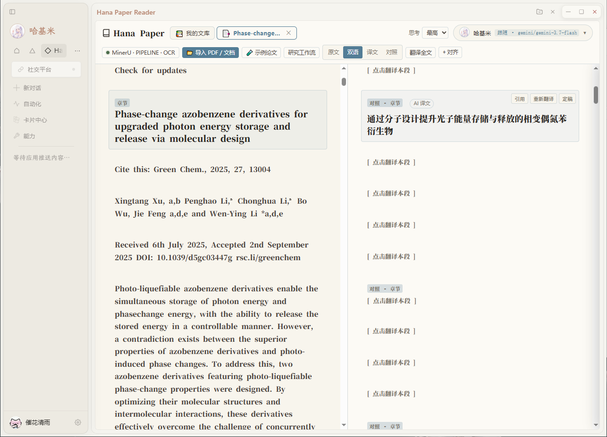
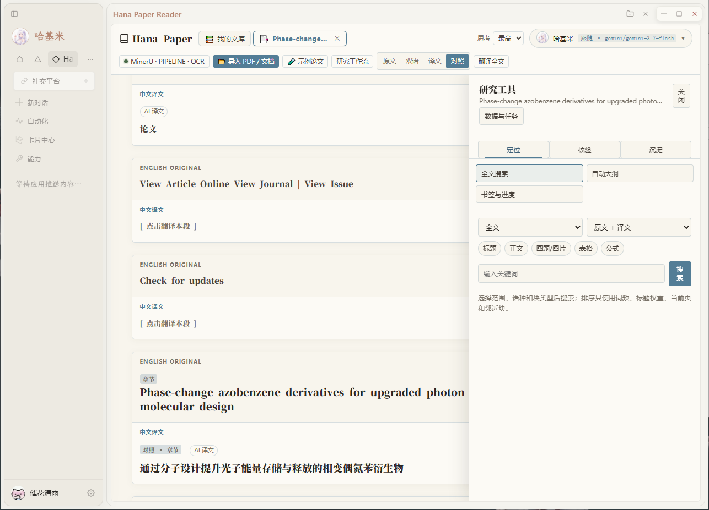
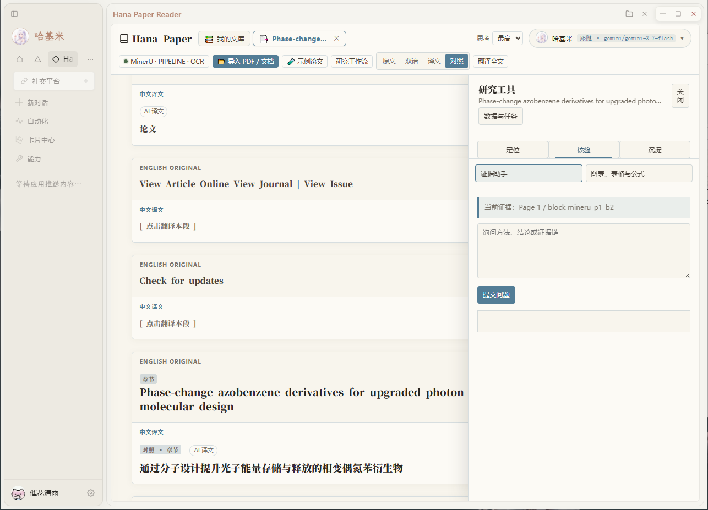
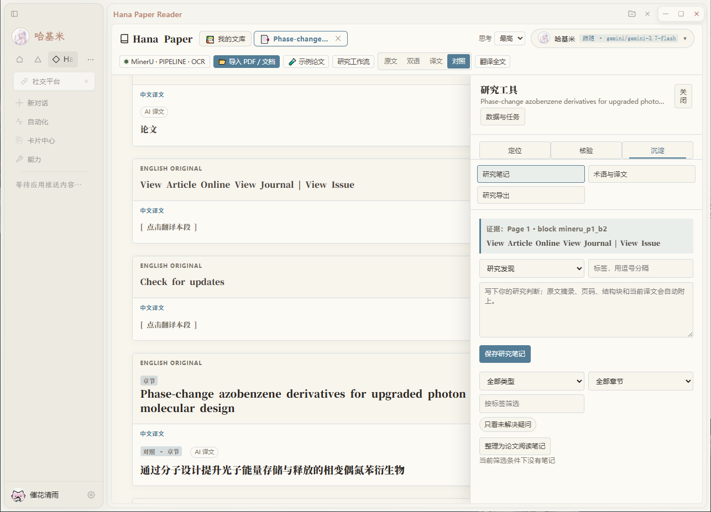
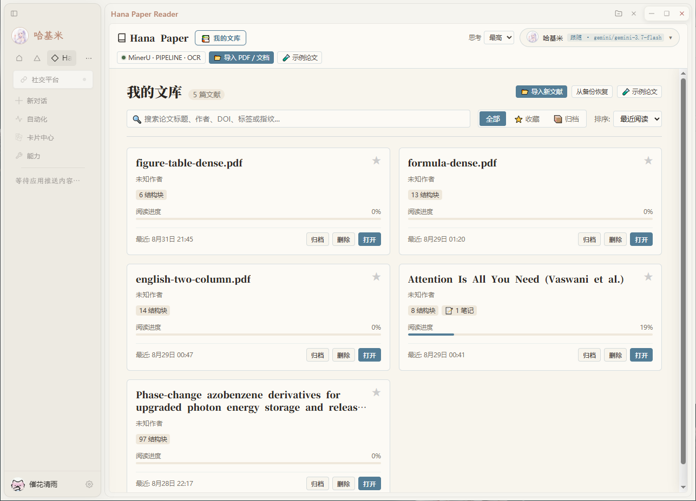
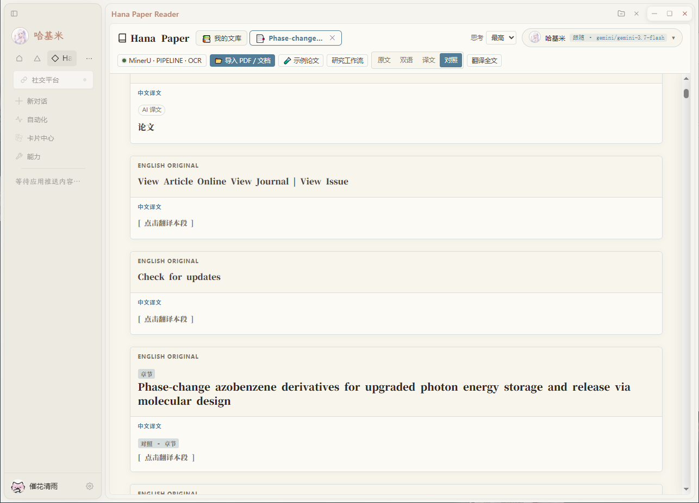
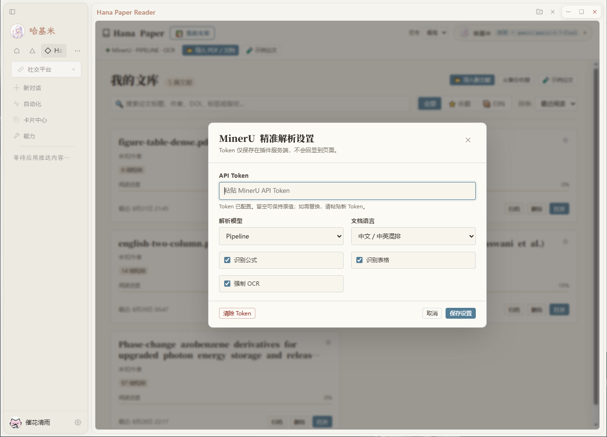

# Hana Paper Reader

面向 **HanaAgent** 的可引用双语论文精读工作台。

它不只是把 PDF 翻译成中文，而是把论文转换为一个可以搜索、定位、引用、提问、批注和导出的研究工作区：**MinerU 提取语义结构，PDF.js 保留原始页面证据，Hana 助手负责翻译与解释，稳定的 `Page X / block Y` 锚点把每个结论带回原文。**

- 当前版本：`0.9.0`
- 插件 ID：`hana-paper-reader`
- 最低 Hana 版本：`0.686.15`
- 许可证：MIT
- 运行方式：无构建步骤、无 npm 依赖的 direct WebView 插件



## 为什么是 Paper Reader

普通 PDF 阅读器解决“把页面显示出来”，Hana Paper Reader 解决的是另一组问题：

- 这段译文对应原文哪一页、哪一个结构块？
- 助手给出的结论能不能回到论文证据？
- 图、表、公式和正文能否在双语阅读中保持一致？
- 笔记、术语、书签和阅读进度能否在下次打开时继续使用？
- 同一份 PDF 能否避免重复上传和重复解析？
- 阅读结果能否离开插件，沉淀为带证据锚点的 Markdown？

0.6.0 将这些能力收束为统一 Evidence 证据对象，以及“定位、核验、沉淀”三条本地优先、证据优先的研究工作流。0.6.1 在此基础上补齐四类证据型笔记、可解释的论文内检索、图表证据区、每篇论文独立存储、数据分项清理、完整备份恢复和可重复发版门禁。0.8.0 进一步解决 Hana WebView 中浏览器下载接口不一定真正落盘的问题：Markdown 与完整备份优先由插件后端写入 Windows `Downloads` 目录，并保留宿主与原生下载回退。0.9.0 将这些能力完成为可实机使用的论文库交互：删除确认、CSV 导出、剪贴板降级和公式 LaTeX 复制均有明确反馈，并修复开发版资源会话凭据在 WebView 中丢失导致的加载问题。

## 核心能力

### 连续双语精读

- 支持 PDF、TXT 和 Markdown。
- PDF 由 MinerU 提取标题、段落、图片、图表、表格和公式结构。
- 正文统一重排为连续单栏，不把原 PDF 的多栏版面硬塞进阅读流。
- 提供原文、双语、译文和对照四种轻量阅读模式；双语模式在窄窗口自动切换为上下布局，对照模式按段落上下排列英文原文与中文译文。
- 支持单段翻译、全文批量翻译和按结构块对齐。
- 支持从本机动态读取全部 Agent，并为每个 Agent 单独选择「跟随 Agent」或已配置的聊天模型；模型引用始终使用精确的 `provider/id`，选择偏好保存在当前浏览器本地。
- 明确区分 AI 译文与用户定稿；用户定稿默认锁定，全文翻译和术语变化不会覆盖。
- 纯图片、空视觉块和无说明公式不会被无意义地送入翻译模型。

### 可核验的引用锚点

每个论文结构块都维护稳定的来源信息：

```text
evidenceId
paperHash
blockId
page
bbox
blockType
sectionId
sectionTitle
validationStatus
```

正文可直接复制带来源引用，例如：

```text
【论文引用】
论文：Attention Is All You Need
来源：Page 5 / block mineru_p5_b12
锚点：#paper-p5-b-mineru_p5_b12
原文：...
```

证据助手只能引用当前工作区中真实存在的 `Page X / block Y`，客户端提供的页码和 block 只作为线索，最终由插件后端重新核验。

### 三条研究工作流

点击顶部 **研究工作流** 可以使用：

| 工作流 | 工具 | 能力 |
|---|---|---|
| 定位 | 全文搜索、自动大纲、书签与进度 | 按当前页、当前章节或全文检索原文/译文，筛选块类型，查看高亮、上下文和可解释排序，并回到真实论文块 |
| 核验 | 证据助手、图表/表格/公式 | 检查助手实际使用的 Evidence；查看图表本体、标题、上下文与译文，并复制 Markdown、CSV 或 LaTeX |
| 沉淀 | 研究笔记、术语与译文、研究导出 | 用研究发现、方法与条件、疑问、局限与风险四类笔记沉淀判断，并绑定稳定 Evidence |
| 独立入口 | 数据与任务 | 查看解析阶段、存储占用和失败原因，取消任务，分项清理、备份或恢复论文研究数据 |

#### 定位工作流（全文搜索与筛选）



#### 核验工作流（证据助手与图表公式）



#### 沉淀工作流（四类证据型笔记与导出）



### 工作区自动恢复

重新打开插件时，会恢复最近论文的：

- 结构块、大纲和最后活动段落；
- 已生成 AI 译文、用户定稿和阅读模式；
- 原文区、译文区各自的滚动位置；
- 笔记、书签及其 Evidence 关系，以及尚未提交的笔记草稿；
- 搜索关键词、范围、语种和块类型筛选；
- 阅读进度；
- 术语版本和有效翻译缓存。

浏览器不会永久保留本地 PDF 文件句柄，因此结构内容可以自动恢复，但 PDF.js 原页预览需要用户重新选择同一 PDF。重新选择后会通过 SHA-256 命中解析缓存，不必再次完整上传解析。

### 标准 SHA-256 解析缓存

- 浏览器对 PDF 计算标准 SHA-256 文件指纹。
- 插件后端按文件指纹复用 MinerU 解析结果。
- 再次选择完全相同的 PDF 时，可直接恢复结构块和资源。
- 浏览器原生 Web Crypto 与内置 fallback 使用同一组标准测试向量验证。

### 术语版本化翻译

术语表不是只在界面上展示，它会参与翻译请求和缓存键：

```text
paperHash + blockId + glossaryVersion + agentId + modelRef
```

新版本会把 Agent 和模型选择纳入 AI 翻译缓存的上下文；切换 Agent 或显式模型不会误用另一套模型生成的译文。旧版未带模型上下文的缓存仍可由旧调用方读取，但新选择器会使用隔离后的缓存键。

新增、修改或删除术语后，术语版本增加，旧版本 AI 译文立即失效，避免旧译法从缓存重新出现；用户定稿始终保留，不参与自动失效和全文覆盖。

### 图、表、公式与原页证据

- 优先展示 MinerU 结果 ZIP 中被正文实际引用的图片资源。
- 只有坐标而没有独立资源时，可从当前本地 PDF 原页生成视觉裁剪。
- 图表证据卡同时展示本体、图题/表题、章节、页码、前后相关正文和对应译文。
- 每张证据卡可以回到正文和 PDF 原页，并复制包含论文、页码、block 与 Evidence ID 的 Markdown。
- 表格 HTML 经过标签、属性、节点数量和体积限制后再渲染，可导出 UTF-8 CSV。
- 公式保留 LaTeX、公式文本和可用的原页定位，可单独复制 LaTeX。
- 两侧阅读区复用同一视觉资源，翻译只改变说明文本。
- PDF.js 仅负责本地原页预览和定位，不参与正文结构解析。

### 数据所有权与分篇存储



工作区 schema 3 使用 `per-paper-v1` 分篇布局：每篇论文的结构、研究记录、译文和任务写入独立目录。旧版单文件工作区首次打开前会自动备份，再迁移到新布局。

数据与任务页会展示论文结构、图片与表格缓存、译文缓存、笔记与书签及总占用空间，并明确区分：

- 仅清理解析视觉缓存；
- 仅清理 AI 译文，保留用户定稿；
- 保留证据型笔记后删除论文结构；
- 删除整篇论文及其全部研究数据。

每个动作都会先说明“删什么、留什么”。完整 JSON 备份不包含 MinerU Token 或模型会话；恢复前会校验附件路径、Base64、数量、单附件大小和总大小，校验通过后才替换现有数据。

研究导出优先由插件后端 Node.js 直接写入 Windows `Downloads` 目录。非法文件名字符会被清洗，同名文件自动追加 `(1)`、`(2)` 等后缀，不覆盖已有成果；写盘失败时仍可回退到宿主 `resource.open` 或原生导航下载。

## 工作原理

```text
本地 PDF
  ├─ 浏览器计算 SHA-256 ──> 查询插件私有解析缓存
  ├─ 原始 application/pdf ─> 插件后端 ─> MinerU 官方 API
  └─ 本地文件字节 ─────────> PDF.js 原页视觉预览

MinerU 结果 ZIP
  └─ 结构 JSON + 受支持图片
       └─ 连续单栏结构块
            ├─ 原文 / 译文
            ├─ Page / block 引用
            ├─ 搜索 / 大纲 / 证据助手
            ├─ 笔记 / 书签 / 进度 / 术语
            └─ 双语 Markdown 导出
```

组件职责保持明确：

| 组件 | 职责 | 不负责 |
|---|---|---|
| MinerU | PDF 语义结构、公式、表格和视觉资源提取 | 本地离线解析 |
| PDF.js | 当前本地 PDF 的原页显示和视觉定位 | 生成正文结构 |
| Hana 模型 | 翻译、解释、证据问答 | 伪造页码或结构块 |
| 插件工作区 | 缓存、引用、笔记、书签、进度、术语和导出 | 存储 MinerU Token 明文到页面 |

## 安装

### 环境要求

- HanaAgent `0.686.15` 或更高版本；
- 如需解析 PDF，需要有效的 MinerU API Token；
- 如需翻译和证据问答，需要 Hana 中存在可用的聊天或实用模型；若要使用 Paper Reader 的模型选择器，需要可读取聊天模型目录的宿主版本。

本插件没有构建步骤，无需安装 Node.js 包、Python 依赖或浏览器扩展。

### 安装发布 ZIP

1. 打开 **Hana 设置 → 插件**。
2. 将发布包 `hana-paper-reader-x.y.z.zip` 拖入插件区域，或使用手动安装入口选择 ZIP。
3. 核对插件 ID 为 `hana-paper-reader`。
4. 确认 `full-access` 权限并安装。
5. 启用插件，从卡片中心打开 **Hana Paper Reader**。

发布 ZIP 的根目录应直接包含：

```text
manifest.json
index.js
README.md
ROADMAP.md
assets/
lib/
licenses/
routes/
tests/
```

### 从源码目录安装

```powershell
git clone https://github.com/TheEarlyWinter/hana-paper-reader.git
```

随后把整个 `hana-paper-reader` 文件夹交给 Hana 的插件安装入口。开发调试时，也可以在 **设置 → 插件** 中启用 Agent 插件开发工具，再通过 Hana 的开发插件流程加载源码目录。

## 快速开始



1. 打开 **Hana Paper Reader**，首屏只需在三个入口中选择：`体验示例论文`、`配置 MinerU`、`导入我的论文`。
2. 想先体验界面，可点击 `体验示例论文`，无需 MinerU。
3. 正式解析 PDF 前，点击 `配置 MinerU`，填写 Token，选择模型、语言、公式、表格和 OCR 设置并保存。
4. 点击 `导入我的论文` 或拖入 PDF；界面会依次显示“正在上传论文”“正在等待 MinerU 解析”“正在整理正文和图表”“论文已准备好”。
5. 选择 `原文`、`双语`、`译文` 或 `对照` 阅读模式；「对照」会把每个英文段落和对应中文译文上下排列。点击单段 `译`，或使用顶部 `翻译全文`。
6. 对 AI 译文点击 `定稿`，编辑并保存为默认锁定的用户定稿。
7. 在双语模式使用 `⌖ 对齐` 将另一侧定位到当前活动段落。
8. 点击正文 `引用` 复制带页码和结构块的来源；划选原文或译文可直接创建四类证据型笔记。
9. 打开 `研究工作流`，继续定位、核验、沉淀、备份或导出 Markdown。

TXT 和 Markdown 在页面本地读取，不会发送到 MinerU。

## MinerU 解析流程

1. 新版 WebView 以原始 `application/pdf` 二进制请求体上传 PDF，不生成 Base64 JSON。
2. 插件后端流式接收，并执行 50 MB 不可绕过的硬上限。
3. 后端向 `POST /api/v4/file-urls/batch` 申请签名上传地址。
4. PDF `Buffer` 直接 `PUT` 到签名地址，不额外设置 `Content-Type`。
5. 后端轮询 `/api/v4/extract-results/batch/{batch_id}`。
6. 完成后下载并安全解包 MinerU 结果 ZIP。
7. 从 `content_list_v2.json`、`content_list.json` 或 `middle.json` 归一化结构块。
8. 仅把正文实际引用的受支持图片写入插件私有缓存。

批量申请请求遵循 MinerU 官方字段位置：

- 根层：`model_version`、`enable_formula`、`enable_table`、`language`；
- `files[0]`：`name`、`data_id`、`is_ocr`。

MinerU 官方 API 文档：<https://mineru.net/apiManage/docs>

### 旧版兼容与 OCR fallback

- 新卡片只使用原始二进制上传。
- 为升级后仍存活的 0.4.0 卡片保留了有界、逐字符校验的 Base64 JSON 接收兼容层；关闭并重新打开卡片后会自动回到二进制协议。
- 普通 MinerU 任务明确失败，或返回缺失、不可解析、没有可用结构块的结果时，会自动以 `is_ocr=true` 重新提交一次。
- Token、401/403、申请地址、上传、轮询网络、下载、ZIP 安全校验和超时错误不会盲目 OCR 重试。
- 用户已经开启强制 OCR 时，不会重复提交第二次 OCR。

## MinerU 设置与 Token 安全

### 阅读器内设置



点击顶部 `MinerU 未配置` 或 `MinerU · VLM`，可以设置：

- API Token；
- 解析模型：`vlm` 或 `pipeline`；
- 文档语言：`ch`、`en`、`japan` 或 `latin`；
- 公式识别；
- 表格识别；
- 强制 OCR。

首次导入 PDF 且尚未配置 Token 时，插件会先打开设置窗口；保存成功后继续刚才的导入。

### Hana 高级设置

在 **Hana 设置 → 插件 → Hana Paper Reader** 中还可调整：

- MinerU API 地址：默认 `https://mineru.net/api/v4`，只接受 `mineru.net` 官方 HTTPS 域名；
- 解析超时：默认 900 秒，范围 60～3600 秒；
- 轮询间隔：默认 5 秒，范围 2～30 秒。

### Token 边界

- Token 通过插件后端写入 Hana 的 `sensitive` 全局配置。
- WebView 只能获得“已配置 / 未配置”状态，读取接口永远不返回 Token。
- 已保存 Token 不会预填或回显；输入框留空表示保留原值。
- Token 不会写进发布 ZIP、README、测试夹具或插件日志。
- 可以在阅读器设置中明确清除 Token。

## 隐私与数据边界

1. **PDF 会上传到 MinerU。** 选择 PDF 或点击重解析会将文件发送到用户配置的 MinerU 官方 API；本插件没有离线 PDF 结构解析分支。
2. **TXT / Markdown 不上传到 MinerU。** 两种文本格式由 WebView 本地读取。
3. **Token 只在插件服务端使用。** 页面无法读取明文 Token。
4. **翻译和助手问答使用当前 Hana 配置。** 文本是否由远程模型处理，取决于用户自己的供应商和模型设置。
5. **原页预览只使用本地文件。** PDF.js 不访问第三方 PDF URL。
6. **研究数据写入插件私有目录。** 论文结构、任务、笔记、书签、进度、术语和翻译缓存不会混入用户原 PDF。
7. **MinerU 视觉资源写入插件私有缓存。** 最多保留 8 份缓存，总量约 1 GiB，并按新旧自动淘汰。

使用前请同时遵守 MinerU 的服务条款、隐私政策、额度限制和文档处理要求。

## 安全限制

- PDF 最大 50 MB；前端先检查，后端按二进制流累计字节再次执行硬上限。
- MinerU 官方服务可能另有不超过 200 MB、200 页等限制，以其最新规则为准。
- MinerU 结果 ZIP 最大 250 MB。
- 单个 ZIP 条目最大 120 MB，实际总解压体积最大 500 MB，最多 10,000 个条目。
- 单份结构化 JSON 最大 64 MB，最多归一化 20,000 个结构块。
- 单个表格 HTML 最大 1,000,000 字符，并在渲染前执行标签、属性和节点限制。
- ZIP 路径必须是安全相对路径；绝对路径、盘符路径及 `.` / `..` 路径会被拒绝或忽略。
- 缓存视觉资源仅允许 PNG、JPEG、WebP、GIF 和 BMP。
- 单个翻译块后端上限为 12,000 字符；全文翻译按小批次执行。
- 用户提供的表格 HTML 仅作为代码围栏导出，不在 Markdown 导出过程中执行。

## 0.9.0 更新摘要

- 文库删除按钮改为稳定容器事件委托；确认弹窗移到 `document.body`，取消不会触发删除，确认操作不会重复执行。
- 新增表格 CSV 导出接口，支持直接落盘、宿主资源下载、Blob 和原生导航回退，并对特殊字符和表格公式注入做安全处理。
- Markdown、引用和公式复制增加宿主剪贴板、浏览器 Clipboard API 与 `textarea + execCommand` 降级；浏览器拒绝写入时仍给出明确提示。
- 图表、表格和公式工具的操作入口增加可见文本、`title` 与 `aria-label`；公式块只有文本没有独立图片资源时仍显示“复制 LaTeX”。
- 修复 WebView 资源基地址清洗误删 `pluginSurfaceSession` 的问题，保留会话凭据并继续拒绝跨源脚本资源。
- 通过 Windows 10 / HanaAgent 0.769.0 实机回归，目标交互无阻塞；全量 Node 测试 75/75 通过。

## 0.8.0 更新摘要

- 双语 Markdown 和完整研究备份优先由插件后端直接写入 Windows `Downloads` 目录，返回实际文件名、路径和大小。
- 论文标题导出经过 Windows 文件名清洗，同名导出自动追加序号，不覆盖已有 Markdown 或备份。
- 研究导出和完整备份增加下载友好的 GET 路径、附件响应头和 `private, no-store` 缓存策略。
- Hana WebView 中保留宿主 `resource.open` 与原生导航下载回退；导出成功、失败和回退路径都有可见提示。
- 多个插件路由实例并发写入同一工作区时通过进程内队列串行化，避免旧实例覆盖术语、笔记或论文状态。
- 术语版本、AI 译文缓存和用户定稿边界继续保持一致；术语更新只使 AI 译文待重译，不覆盖用户定稿。
- 完整备份恢复继续校验结构、研究记录、术语、任务和可选视觉附件，并拒绝凭据与不安全附件路径。

## 0.7.0 更新摘要

- Agent 选择器改为动态读取本机全部 Agent，不再限制为固定的五个助手。
- 新增聊天模型目录接口，使用宿主稳定的 `provider:models-by-type({ type: "chat" })` 发现已配置模型。
- 每个 Agent 支持独立的「跟随 Agent」或显式 `provider/id` 模型偏好；后端会重新校验所选模型，不可用时明确返回错误，不静默回退。
- Paper Reader 自己创建的翻译、划词问答、证据问答和「新建对话并发送」会话会使用所选模型；切换模型不会复用另一模型的内部会话缓存。
- 发送到已有普通对话仍只调用 `session:send`，不会修改目标会话已经绑定的 Agent 或模型。

## 0.6.3 更新摘要

- 划词发送改为显式会话目标：用户可从公开对话列表中手动选择目标，不再静默创建或复用一个 Paper Reader 会话。
- 新增「新建对话并发送」独立动作；只有用户明确点击该动作时才创建新会话。
- 目标选择使用短期 opaque token，前端不接触宿主 session path；发送前由后端重新校验目标会话。
- Card Center 直接打开时不猜测 Hana 当前主聊天；在宿主尚未提供可信来源 `sessionRef` 前，统一显示「选择对话…」。

## 0.6.2 更新摘要

- 新增「对照」阅读模式，与「原文 / 双语 / 译文」组成四种阅读视图。
- 对照模式使用单栏、单滚动区，把每个英文原文块与对应中文译文按上下顺序紧邻展示。
- 图片、表格和公式本体只在原文部分展示一次，译文部分保留对应说明，避免重复视觉内容。
- AI 译文、用户定稿、单段翻译、引用、搜索定位和证据型笔记继续复用同一结构块状态。
- 独立保存并恢复对照模式及其滚动位置；双语左右分栏行为保持不变。

## 0.6.1 更新摘要

- 新增研究发现、方法与条件、疑问、局限与风险四类证据型笔记，自动保存原文、页码、结构块、译文和 Evidence 快照。
- 搜索扩展为当前页/当前章节/全文范围，支持原文/译文/双语和块类型筛选，提供命中高亮、上下文和可解释评分。
- 大纲联动阅读进度、书签与未解决疑问统计。
- 图表实验入口升级为图表证据区，支持关联正文、带来源 Markdown、表格 CSV 和公式 LaTeX。
- 工作区 schema 升级为 3，使用每篇论文独立存储；新增存储统计、分项清理、整篇删除、完整备份与安全恢复。
- 精确恢复活动段落、双侧滚动、阅读模式、笔记草稿和搜索条件。
- 新增英文双栏、中文、扫描页、公式密集、图表/表格密集五类固定合成 PDF，并将语法、测试、ZIP、反解、复测、敏感扫描、SHA-256 和 UTF-8 Release Notes 固化为发版流水线。

## 0.6.0 更新摘要

- 新增统一 `Evidence` 证据对象，搜索结果、证据助手、划词问答、会话发送、笔记、书签和视觉块共用同一证据契约。
- Evidence ID 由 `paperHash + blockId` 确定性生成，重开论文后保持稳定。
- 研究工具重组为“定位、核验、沉淀”三条一级工作流，解析任务保留为独立“数据与任务”入口。
- 新增原文、双语、译文三种轻量阅读模式，并持久化最近使用模式。
- 新增 AI 译文与用户定稿状态；用户定稿可编辑、默认锁定，全文翻译和术语变化不得覆盖。
- 工作区 schema 升级为 2，旧数据首次加载时自动备份并迁移 Evidence 关系。
- 双语 Markdown 导出新增稳定 Evidence ID，并区分 AI 译文与用户定稿。
- 保留 MinerU 原始二进制协议、旧 Base64 卡片兼容、OCR fallback 和 PDF.js 原页预览。

完整方向见 [ROADMAP.md](ROADMAP.md)。

## 开发与验证

仓库没有 `package.json`，测试直接使用 Node.js 内置测试运行器。

运行全部语法检查：

```powershell
$files = Get-ChildItem -Recurse -File -Include *.js,*.mjs
foreach ($file in $files) {
  node --check $file.FullName
  if ($LASTEXITCODE -ne 0) { exit $LASTEXITCODE }
}
```

运行全部测试：

```powershell
$tests = Get-ChildItem tests -File -Filter *.mjs |
  Sort-Object Name |
  ForEach-Object FullName
node --test @tests
```

0.9.0 当前测试覆盖：

- MinerU 二进制协议与旧 Base64 兼容；
- OCR fallback 触发边界；
- 论文工作区持久化、schema 1/2 → 3 迁移备份、分篇存储与最近论文恢复；
- 稳定 Evidence ID、统一证据解析和笔记/书签 Evidence 关系；
- 搜索、大纲、任务、笔记、书签、进度和术语 CRUD；
- 术语版本化翻译缓存与用户定稿防覆盖；
- SHA-256 原生与 fallback 一致性；
- 后端解析缓存命中；
- 真实结构块引用核验；
- 双语 Markdown、编号转义和 LaTeX 保真；
- 四类笔记、可解释搜索、数据分项清理、完整删除及备份恢复边界；
- 五类固定合成 PDF 的类型、文件头、大小和 SHA-256 不变性；
- 静态资源与旧 MinerU 路由回归；
- 会话目标列表、显式发送、路径兼容和无目标不创建会话回归；
- 动态 Agent / 聊天模型发现、精确 `provider/id` 校验、会话创建模型 payload、模型缓存隔离和已有会话不切换模型回归。

一键执行完整发版门禁：

```powershell
./scripts/build-release.ps1 -Version 0.9.0 -OutputDir ../dist
```

脚本会按固定顺序执行语法检查、源码测试、净目录 ZIP、反向解包、逐文件哈希比对、解包后复测、敏感数据扫描、SHA-256 和 QA 报告。GitHub Release 正文只从仓库内 UTF-8 `RELEASE_NOTES_0.9.0.md` 读取。

## 开源与第三方软件

- Hana Paper Reader 依据 [MIT License](LICENSE) 发布。
- `assets/pdfjs.mjs` 来自 Mozilla PDF.js 5.6.205，依据 Apache License 2.0 分发。完整许可证见 [licenses/PDFJS-APACHE-2.0.txt](licenses/PDFJS-APACHE-2.0.txt)，归属说明见 [THIRD_PARTY_NOTICES.md](THIRD_PARTY_NOTICES.md)。
- 感谢 [PaperQuay](https://github.com/WangQrkkk/PaperQuay/tree/main) 在论文精读产品设计与单篇阅读流程方面提供的思路和启发。

## 设计原则

- **证据优先：** 助手生成的研究结论必须尽可能回到真实论文块。
- **结构与视觉分离：** MinerU 理解结构，PDF.js 保留页面证据。
- **低成本动作优先：** 搜索、目录、定位、笔记和缓存尽量本地完成。
- **结果可复用：** 阅读成果必须能导出并保留证据链。
- **网络可控：** 只有用户明确导入 PDF、翻译或提问时才触发对应外部处理。
- **单一路线：** PDF 结构解析只使用 MinerU，不恢复第二套本地解析器。
